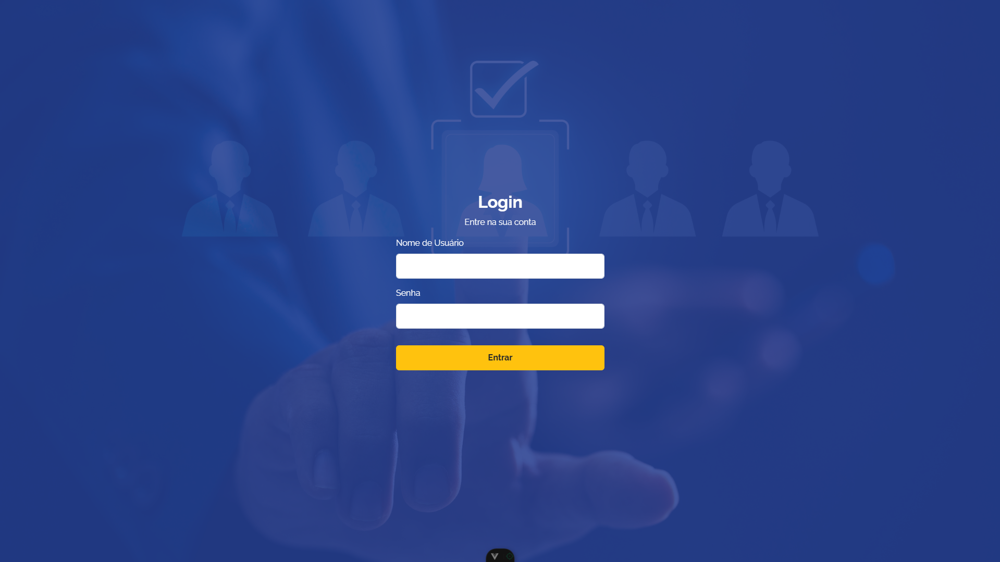
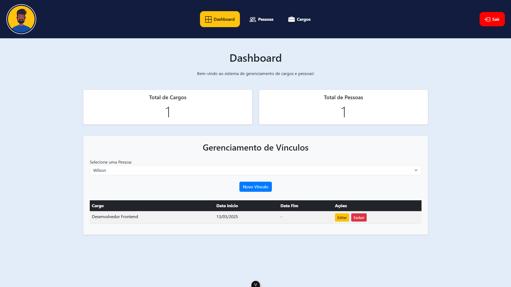
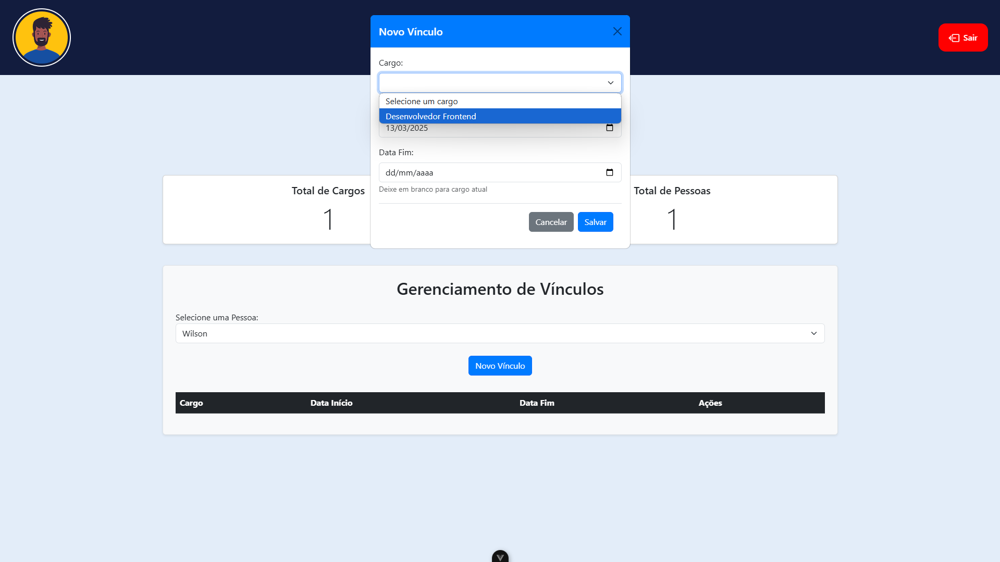
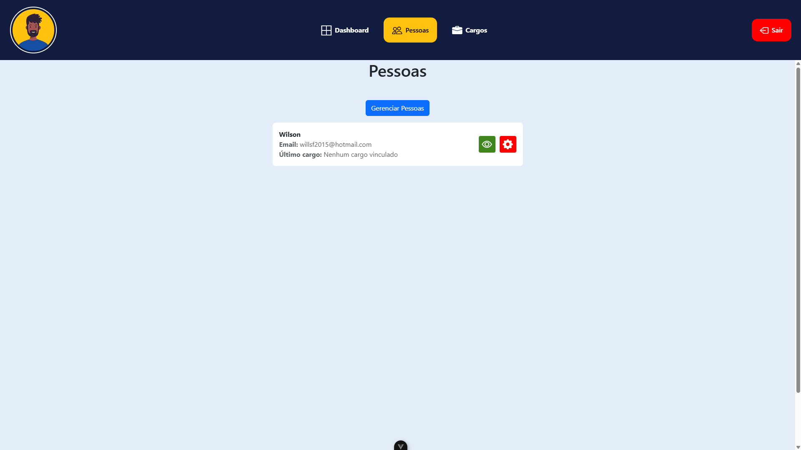
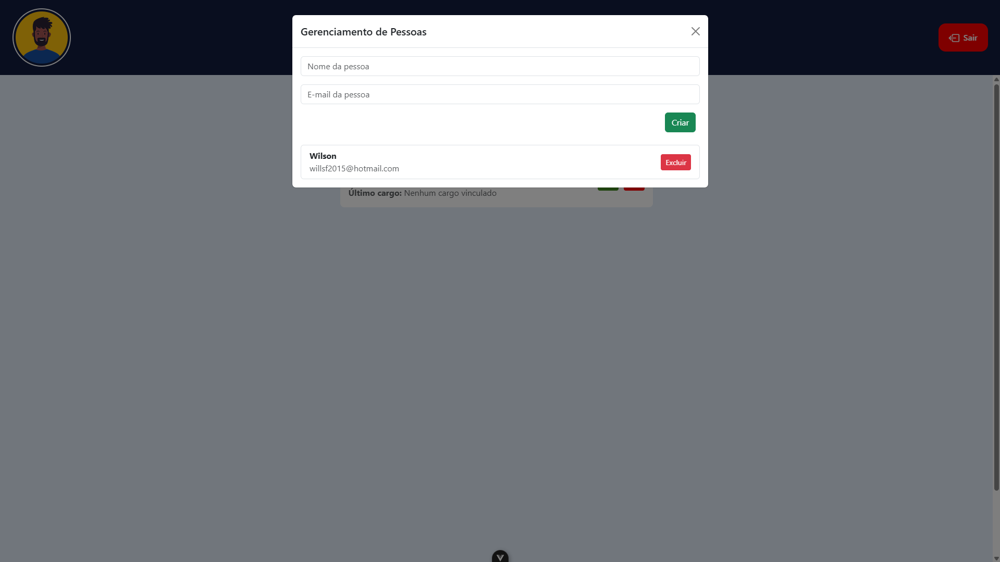
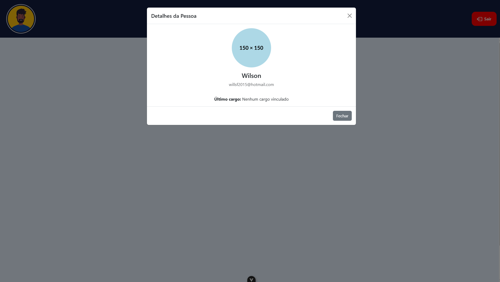
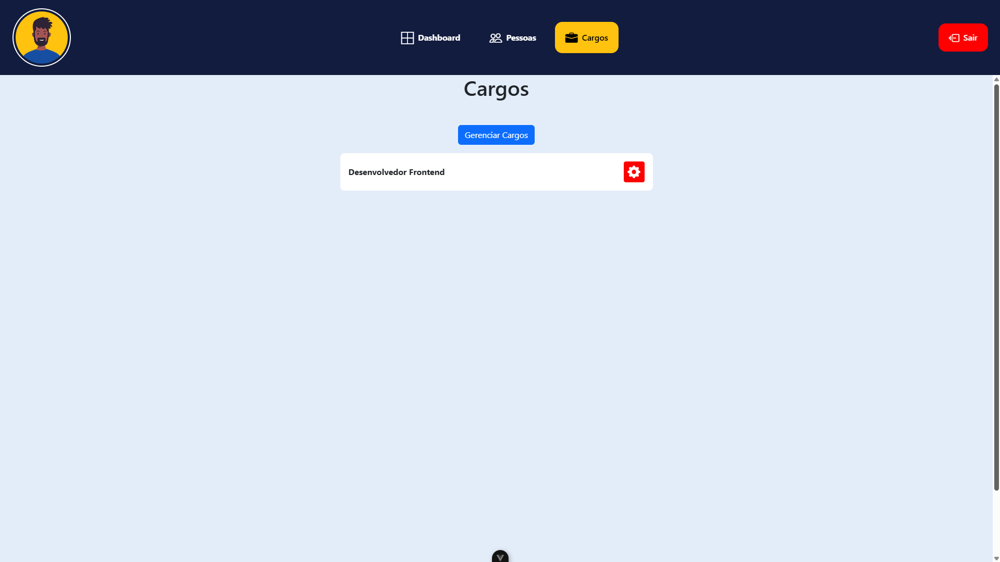
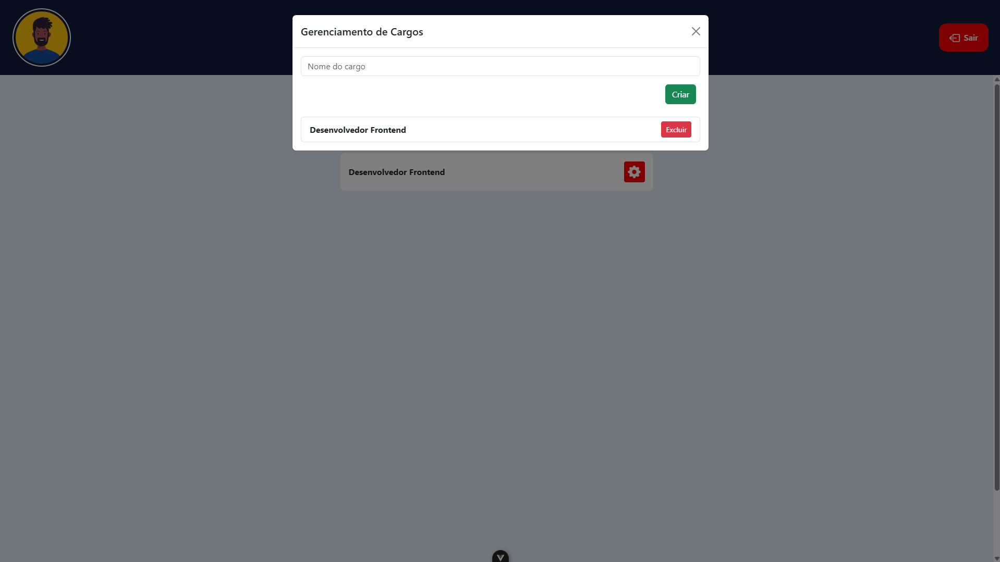
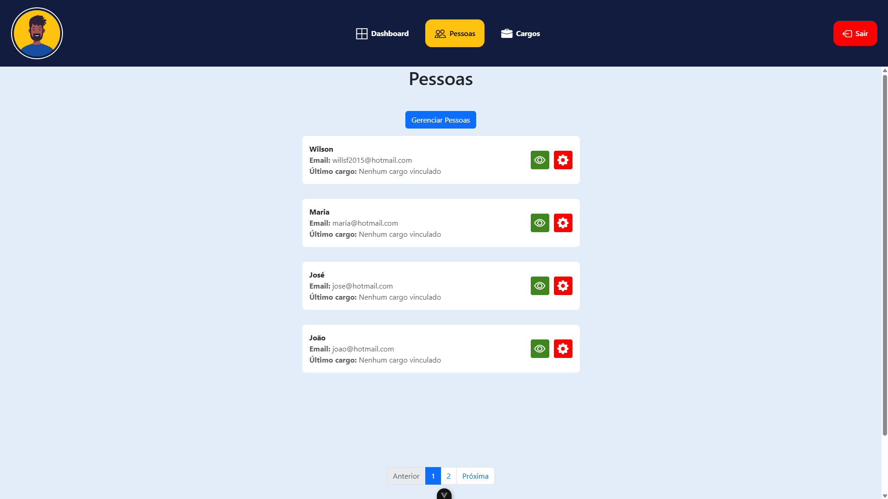

# Screenshots do Projeto

Aqui estão algumas capturas de tela do projeto para demonstrar sua funcionalidade e aparência.

## 📌 Tela de Login

## 📌 Dashboard

## 📌 Gerenciamento de Vínculos

## 📌 Pessoas

## 📌 Gerenciamento de Pessoas

## 📌 Detalhes da Pessoa

## 📌 Cargos

## 📌 Gerenciamento de Cargos

## 📌 Exemplo de Paginação

